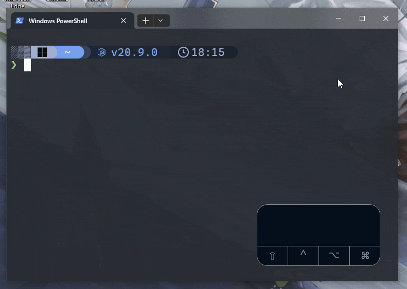

# KeyLogger

A simple key logger that logs the keystroke onto the screen for Windows.

## Roadmap

- [x] Configurable Settings
- [x] Display in Systems Tray
- [x] Refactor
- [x] Unit Testing
- [x] Azure Pipeline
- [ ] Logging (Metadata only)
- [x] Autofac IoC
- [ ] Preset themes
- [ ] Benchmarks
- [ ] Help window

## Known Bugs

- [ ] Memory Leak (possibly resolved, need further investigation)
- [ ] Sometimes unable to display the active modifier keys correctly.
- [ ] Sometimes the modifier key remains active despite the key has already been released.

## References

Appreciate these people and resources that make this project possible.

- [fabriciorissetto/KeystrokeAPI](https://github.com/fabriciorissetto/KeystrokeAPI)
- [Darkempire78/Windows-Keylogger](https://github.com/Darkempire78/Windows-Keylogger)
- [Change cursor to hand when I hover over a button](https://stackoverflow.com/questions/23117878/change-cursor-to-hand-when-i-hover-over-a-button)
- [WPF: Remove dotted border around focused item in styled listbox](https://stackoverflow.com/questions/592665/wpf-remove-dotted-border-around-focused-item-in-styled-listbox)
- [TextBlock over a listview: how to ignore clicks in the TextBlock and let the listview handle them](https://stackoverflow.com/questions/6417201/textblock-over-a-listview-how-to-ignore-clicks-in-the-textblock-and-let-the-lis)
- [How do I create a WPF Rounded Corner container?](https://stackoverflow.com/questions/120851/how-do-i-create-a-wpf-rounded-corner-container)
- [Make WPF window draggable, no matter what element is clicked](https://stackoverflow.com/questions/7417739/make-wpf-window-draggable-no-matter-what-element-is-clicked)
- [How to remove white strip on top of WPF window with WindowStyle=None?](https://stackoverflow.com/questions/36631165/how-to-remove-white-strip-on-top-of-wpf-window-with-windowstyle-none)
- [Moving MainWindow.xaml](https://stackoverflow.com/questions/25472765/moving-mainwindow-xaml)
